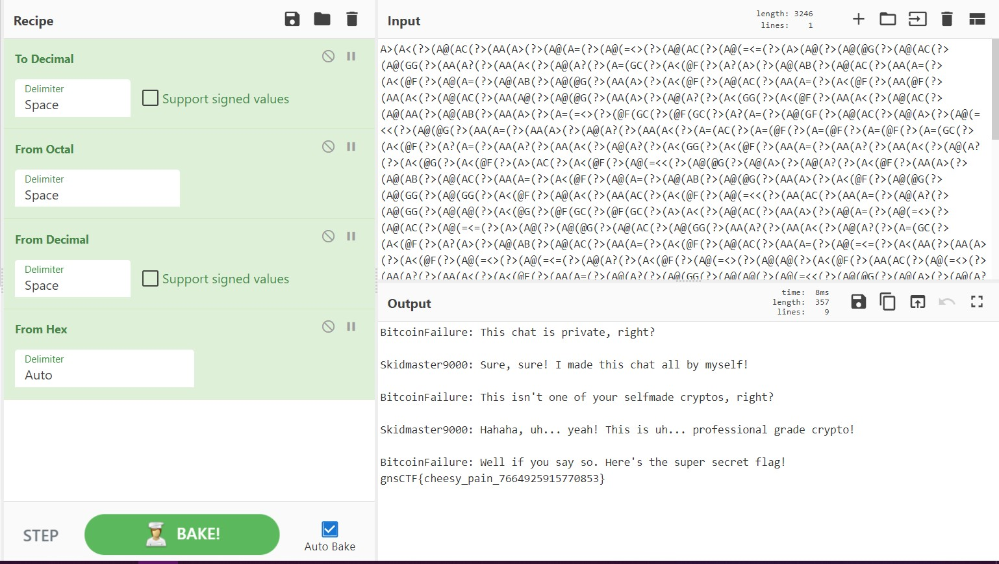

# Sixteen Ten Eight Net

Points: 250

## Category

Crypto

## Question

>Psshhh, only nerds do complex math! Our messages are encrypted with top of the line techniques!
>I bet you can't decode our [messages](files/message.txt)!

### Hint

>Only nerds use complicated math stuff! All our stuff is simple and base-ic!
>
>Sixteen, ten, eight... net??? Why is the last word backwards?
>
>I cook up so much spaghetti online, I'm like a chef... A CyberChef!

## Analysis

Looking at the hints, it's obvious the title plays a pretty huge role in the challenge.

One of the hints also suggest using [CyberChef](https://gchq.github.io/CyberChef/), "The Cyber Swiss Army Knife - a web app for encryption, encoding, compression and data analysis.".

sixteen ten eight net

Sixteen is probably hex, ten is decimal, and eight would be octal. "Net", is ten backwards, so maybe it means the opposite of encoding decimal?

If we try encoding hex, encoding decimal, encoding octal, and decoding decimal, we get something that looks similar to the flag.

To_Decimal('Space',false)To_Octal('Space')From_Decimal('Space',false))

To decode, we can just do it in reverse.

# Solution

From_Octal('Space')From_Decimal('Space',false)From_Hex('Auto')&input=QT4oQTwoPz4oQUAoQUMoPz4oQUEoQT4oPz4oQUAoQT0oPz4oQUAoPTw%2BKD8%2BKEFAKEFDKD8%2BKEFAKD08PSg/PihBPihBQCg/PihBQChARyg/PihBQChBQyg/PihBQChHRyg/PihBQShBPyg/PihBQShBPCg/PihBQChBPyg/PihBPShHQyg/PihBPChARig/PihBPyhBPig/PihBQChBQig/PihBQChBQyg/PihBQShBPSg/PihBPChARig/PihBQChBPSg/PihBQChBQig/PihBQChARyg/PihBQShBPig/PihBPChARig/PihBQChBQyg/PihBQShBPSg/PihBPChARig/PihBQShARig/PihBQShBPCg/PihBQChBQyg/PihBQShBQCg/PihBQChARyg/PihBQShBPig/PihBQChBPyg/PihBPChHRyg/PihBPChARig/PihBQShBPCg/PihBQChBQyg/PihBQChBQSg/PihBQChBQig/PihBQShBPig/PihBPSg9PD4oPz4oQEYoR0MoPz4oQEYoR0MoPz4oQT8oQT0oPz4oQUAoR0YoPz4oQUAoQUMoPz4oQUAoQT4oPz4oQUAoPTw8KD8%2BKEFAKEBHKD8%2BKEFBKEE9KD8%2BKEFBKEE%2BKD8%2BKEFAKEE/KD8%2BKEFBKEE8KD8%2BKEE9KEFDKD8%2BKEE9KEBGKD8%2BKEE9KEBGKD8%2BKEE9KEBGKD8%2BKEE9KEdDKD8%2BKEE8KEBGKD8%2BKEE/KEE9KD8%2BKEFBKEE/KD8%2BKEFBKEE8KD8%2BKEFAKEE/KD8%2BKEE8KEdHKD8%2BKEE8KEBGKD8%2BKEFBKEE9KD8%2BKEFBKEE/KD8%2BKEFBKEE8KD8%2BKEFAKEE/KD8%2BKEE8KEBHKD8%2BKEE8KEBGKD8%2BKEE%2BKEFDKD8%2BKEE8KEBGKD8%2BKEFAKD08PCg/PihBQChARyg/PihBQChBPig/PihBQChBPyg/PihBPChARig/PihBQShBPig/PihBQChBQig/PihBQChBQyg/PihBQShBPSg/PihBPChARig/PihBQChBPSg/PihBQChBQig/PihBQChARyg/PihBQShBPig/PihBPChARig/PihBQChARyg/PihBQChHRyg/PihBQChHRyg/PihBPChARig/PihBQChBPCg/PihBQShBQyg/PihBPChARig/PihBQCg9PDwoPz4oQUEoQUMoPz4oQUEoQT0oPz4oQUAoQT8oPz4oQUAoR0coPz4oQUAoQUAoPz4oQTwoQEcoPz4oQEYoR0MoPz4oQEYoR0MoPz4oQT4oQTwoPz4oQUAoQUMoPz4oQUEoQT4oPz4oQUAoQT0oPz4oQUAoPTw%2BKD8%2BKEFAKEFDKD8%2BKEFAKD08PSg/PihBPihBQCg/PihBQChARyg/PihBQChBQyg/PihBQChHRyg/PihBQShBPyg/PihBQShBPCg/PihBQChBPyg/PihBPShHQyg/PihBPChARig/PihBPyhBPig/PihBQChBQig/PihBQChBQyg/PihBQShBPSg/PihBPChARig/PihBQChBQyg/PihBQShBPSg/PihBQCg9PD0oPz4oQTwoQUEoPz4oQUEoQT4oPz4oQTwoQEYoPz4oQUAoPTw%2BKD8%2BKEFAKD08PSg/PihBQChBPyg/PihBPChARig/PihBQCg9PD4oPz4oQUAoQUAoPz4oQTwoQEYoPz4oQUEoQUMoPz4oQUAoPTw%2BKD8%2BKEFBKEE/KD8%2BKEFBKEE8KD8%2BKEE8KEBGKD8%2BKEFBKEE9KD8%2BKEFAKEE/KD8%2BKEFAKEdHKD8%2BKEFAKEFAKD8%2BKEFAKD08PCg/PihBQChARyg/PihBQChBPig/PihBQChBPyg/PihBPChARig/PihBQChBPSg/PihBQShBPCg/PihBQShBQyg/PihBQShARig/PihBQShBPig/PihBQCg9PD4oPz4oQUEoQT0oPz4oQTwoR0coPz4oQTwoQEYoPz4oQUEoQTwoPz4oQUAoQUMoPz4oQUAoQUEoPz4oQUAoQUIoPz4oQUEoQT4oPz4oQT0oPTw%2BKD8%2BKEBGKEdDKD8%2BKEBGKEdDKD8%2BKEE/KEE9KD8%2BKEFAKEdGKD8%2BKEFAKEFDKD8%2BKEFAKEE%2BKD8%2BKEFAKD08PCg/PihBQChARyg/PihBQShBPSg/PihBQShBPig/PihBQChBPyg/PihBQShBPCg/PihBPShBQyg/PihBPShARig/PihBPShARig/PihBPShARig/PihBPShHQyg/PihBPChARig/PihBPihBQig/PihBQChARyg/PihBQChBQig/PihBQChARyg/PihBQChBQig/PihBQChARyg/PihBPChHRyg/PihBPChARig/PihBQShBPyg/PihBQChBQig/PihBPCg9PD0oPz4oQTwoPTw9KD8%2BKEE8KD08PSg/PihBPChARig/PihBQShBQyg/PihBQChBPyg/PihBQChARyg/PihBQChBQig/PihBPChARyg/PihBPChARig/PihBPyhBPig/PihBQChBQig/PihBQChBQyg/PihBQShBPSg/PihBPChARig/PihBQChBQyg/PihBQShBPSg/PihBPChARig/PihBQShBPyg/PihBQChBQig/PihBPCg9PD0oPz4oQTwoPTw9KD8%2BKEE8KD08PSg/PihBPChARig/PihBQShARig/PihBQShBPCg/PihBQCg9PD4oPz4oQUAoQUAoPz4oQUAoQT8oPz4oQUEoQT0oPz4oQUEoQT0oPz4oQUAoQUMoPz4oQUAoPTw%2BKD8%2BKEFAKD08PSg/PihBQChARyg/PihBQChHRyg/PihBPChARig/PihBQChBQSg/PihBQShBPCg/PihBQChARyg/PihBQChBPig/PihBQChBPyg/PihBPChARig/PihBQChBPSg/PihBQShBPCg/PihBQShBQyg/PihBQShARig/PihBQShBPig/PihBQCg9PD4oPz4oQTwoQEcoPz4oQEYoR0MoPz4oQEYoR0MoPz4oQT4oQTwoPz4oQUAoQUMoPz4oQUEoQT4oPz4oQUAoQT0oPz4oQUAoPTw%2BKD8%2BKEFAKEFDKD8%2BKEFAKD08PSg/PihBPihBQCg/PihBQChARyg/PihBQChBQyg/PihBQChHRyg/PihBQShBPyg/PihBQShBPCg/PihBQChBPyg/PihBPShHQyg/PihBPChARig/PihBPyhBQSg/PihBQChBPyg/PihBQChHRyg/PihBQChHRyg/PihBPChARig/PihBQChBQyg/PihBQChBQCg/PihBPChARig/PihBQShBQyg/PihBQCg9PD4oPz4oQUEoQT8oPz4oQTwoQEYoPz4oQUEoQT0oPz4oQUAoQEcoPz4oQUEoQUMoPz4oQTwoQEYoPz4oQUEoQT0oPz4oQUAoPTw%2BKD8%2BKEE8KD08PSg/PihBPChARig/PihBPihBQig/PihBQChBPyg/PihBQShBPCg/PihBQChBPyg/PihBPChBQSg/PihBQShBPSg/PihBPChARig/PihBQShBPig/PihBQChBQig/PihBQChBPyg/PihBPChARig/PihBQShBPSg/PihBQShBPyg/PihBQShARig/PihBQChBPyg/PihBQShBPCg/PihBPChARig/PihBQShBPSg/PihBQChBPyg/PihBQChBPSg/PihBQShBPCg/PihBQChBPyg/PihBQShBPig/PihBPChARig/PihBQChBQCg/PihBQChHRyg/PihBQChARyg/PihBQChBQSg/PihBPChARyg/PihBPChARig/PihBPChARig/PihBPChARig/PihBPChARig/PihBPChARig/PihBPChARig/PihBQChBQSg/PihBQCg9PD0oPz4oQUEoQT0oPz4oQT4oQT0oPz4oQT8oQT4oPz4oQT4oQUAoPz4oQUEoR0YoPz4oQUAoQT0oPz4oQUAoQUIoPz4oQUAoQT8oPz4oQUAoQT8oPz4oQUEoQT0oPz4oQUEoQUMoPz4oQT8oPTw%2BKD8%2BKEFBKEBGKD8%2BKEFAKEBHKD8%2BKEFAKEFDKD8%2BKEFAKD08PSg/PihBPyg9PD4oPz4oQT0oQUEoPz4oQT0oQUAoPz4oQT0oQUAoPz4oQT0oQT4oPz4oQT0oQUMoPz4oQT0oQTwoPz4oQT0oQT8oPz4oQT0oQUMoPz4oQT0oQEcoPz4oQT0oQT8oPz4oQT0oQUEoPz4oQT0oQUEoPz4oQT0oQEYoPz4oQT0oQUIoPz4oQT0oQT8oPz4oQT0oQT0oPz4oQUEoPTw8)

### Flag

`gnsCTF{cheesy_pain_7664925915770853}`
